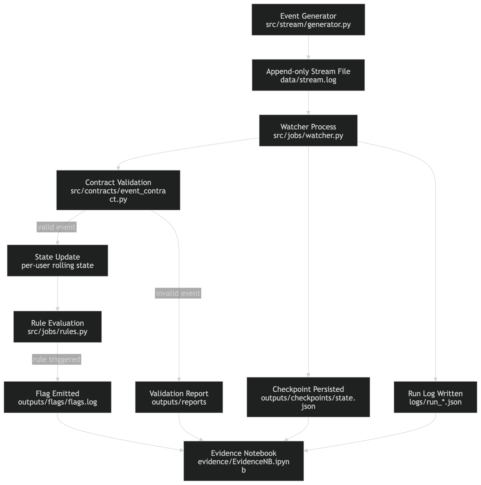

# Compliance Stream Data Pipeline Product


A deterministic streaming-style data pipeline that validates financial transaction events, evaluates compliance rules in near-real time, and produces reproducible audit artifacts including flags, checkpoints, and run logs.

---

# Problem

Financial systems generate continuous streams of transaction events.  
Compliance monitoring requires detecting suspicious patterns such as:

- unusually large transactions
- rapid bursts of deposits
- repeated suspicious behaviour within short windows

These checks must run on a **stream of incoming events**, while ensuring:

- strict schema validation
- deterministic rule evaluation
- no event skipping
- restart-resume safety
- auditable run artifacts

This project implements a **local streaming compliance pipeline** that consumes an append-only event stream and produces rule-based compliance flags with full run evidence.

---

# Architecture Overview



Pipeline flow:

1. Event generator produces transaction events.
2. Events are appended to a persisted stream file.
3. The watcher process consumes new events using byte offsets.
4. Each event is validated against a strict contract.
5. Valid events are evaluated against compliance rules.
6. Suspicious patterns emit flag records.
7. Checkpoints persist stream progress.
8. Run logs and validation reports capture execution evidence.
9. Evidence notebook inspects artifacts for verification.

This architecture models a simplified **stream processing system with deterministic rule evaluation and restart-safe consumption**.

---

# Tech Stack

- Python
- JSONL event streaming
- Contract-based validation
- Stateful rule evaluation
- Pytest testing framework
- Jupyter notebook for run evidence

---

# Project Structure

```
local-stream-data-product/

data/
    sample_stream.log          sample persisted stream input

src/
    contracts/
        event_contract.py      schema validation logic
    pipelines/
        rules.py               compliance rule evaluation
        watcher.py             stream consumer and rule engine
    stream/
        generator.py           event stream producer

tests/
    test_contracts.py
    test_rules.py
    test_generator.py
    test_watcher.py
    test_smoke_pipeline.py

outputs/
    checkpoints/               stream progress checkpoint
    flags/                     emitted compliance flags
    reports/                   validation reports

logs/
    run logs capturing execution metadata

docs/
    architecture.png           system architecture diagram

evidence/
    EvidenceNB.ipynb           run verification notebook

framework/
    stream_framework.ipynb
```

---

# Key Engineering Features

### Contract-first validation
All incoming events are validated against a strict schema before rule evaluation.

### Deterministic rule engine
Rules operate on event state with deterministic behavior for reproducibility.

### Stateful streaming evaluation
Per-user event history enables velocity and repetition detection.

### Fail-fast error handling
Invalid JSON, schema violations, duplicates, or ordering issues terminate the run immediately.

### Restart-resume safety
The watcher persists byte offsets so processing resumes exactly where the previous run stopped.

### Reproducible artifacts
Each run produces:

- run logs
- validation reports
- emitted flags
- checkpoint state

These artifacts allow independent verification of pipeline execution.

### Automated tests
The project includes:

- contract validation tests
- rule evaluation tests
- generator behavior tests
- watcher smoke tests

---

# How to Run

Clone the repository.

```
git clone https://github.com/D-Atul/local-stream-data-product.git
cd local-stream-data-product
```

Create a virtual environment.

```
python -m venv .venv
source .venv/bin/activate
```

Install dependencies.

```
pip install -r requirements.txt
```

Generate a sample stream.

```
python -m src.stream.generator
```

Start the watcher.

```
python -m src.pipelines.watcher
```

Artifacts produced:

```
logs/                 run metadata
outputs/checkpoints/  stream progress state
outputs/flags/        compliance flags
outputs/reports/      validation reports
```

---

# Running Tests

Run all tests with:

```
pytest -q
```

The test suite covers contract validation, rule evaluation, generator behavior, and pipeline startup through a smoke test.

---

# Sample Outputs

Example artifacts generated by the pipeline:

Run log:

```
logs/run_success.json
```

Checkpoint state:

```
outputs/checkpoints/state_success.json
```

Compliance flags:

```
outputs/flags/flag_success.log
```

Validation report:

```
outputs/reports/validation_success.json
```

These artifacts demonstrate deterministic processing and reproducible pipeline behavior.

---

# Evidence Notebook

The notebook in `evidence/` verifies execution artifacts and demonstrates:

- run metadata inspection
- stream offset verification
- restart-resume correctness
- fail-fast validation behavior

This provides a transparent verification layer for pipeline execution.

---

# What This Project Demonstrates

This project demonstrates core data engineering practices required for real streaming systems:

- event stream consumption
- contract-based validation
- stateful rule evaluation
- restart-safe processing
- deterministic outputs
- reproducible execution artifacts
- automated testing discipline

Together, these elements represent the design of a **production-minded streaming compliance data product**.